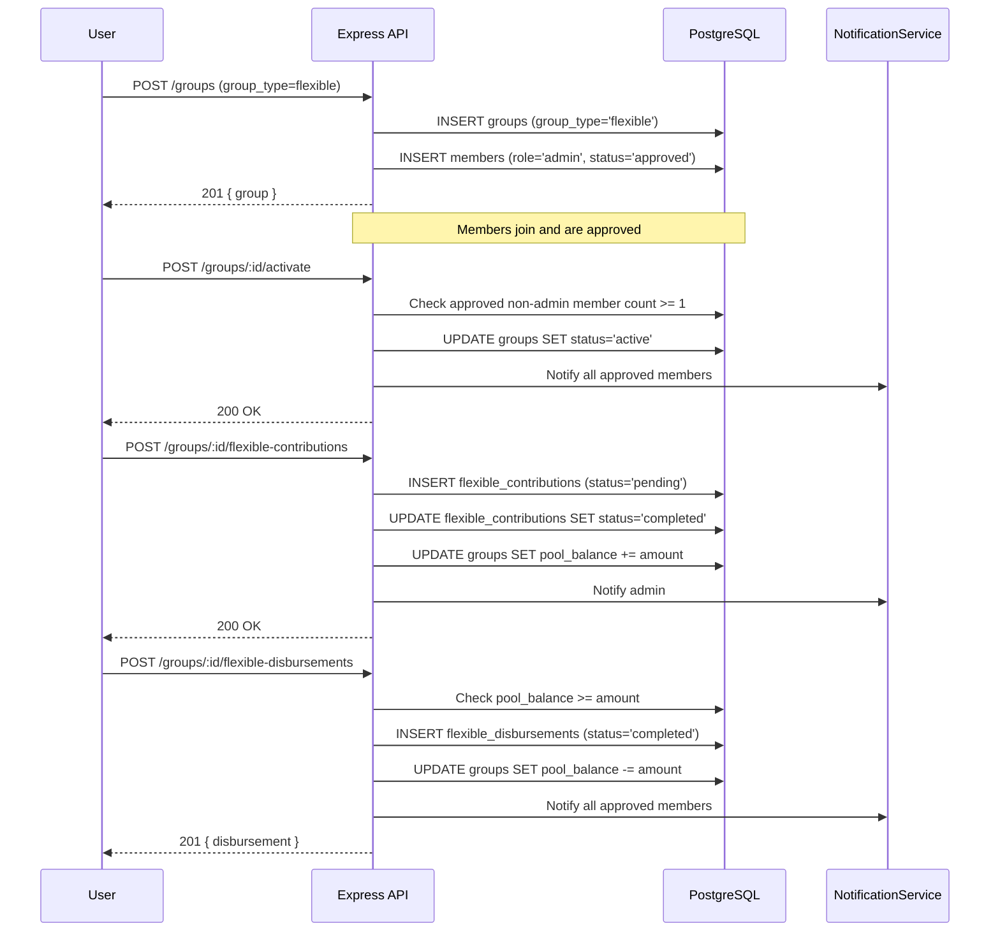

# Design Document: Flexible Contribution Groups

## Overview

Flexible Contribution Groups are a second group type on the NjangiPay platform. Unlike the existing rotating savings (njangi) groups — which enforce a fixed contribution amount, a cycle, and an automated payout queue — a flexible group has no fixed contribution amount, no cycle, and no automated disbursements. Members contribute any amount at any time; the admin manually records all disbursements. The system tracks the pool balance and history but never moves money automatically.

The feature touches four layers:

- **Database** — one new column on `groups`, two new tables (`flexible_contributions`, `flexible_disbursements`), and a migration file
- **Backend** — a new `flexibleGroupController.js`, new routes appended to `backend/src/routes/groups.js`, and a guard added to the existing `groupController.js` to prevent njangi-only operations on flexible groups
- **Web frontend** — a new `CreateFlexibleGroup.jsx` page, a new `FlexibleGroupDetail.jsx` page, a `ContributeFlexible` modal, and a `DisbursementPanel` admin component
- **Shared** — the existing group listing and detail APIs are extended to carry `group_type` so the frontend can branch rendering

---

## Architecture



### Key Design Decisions

- **`group_type` column on `groups`.** A single `VARCHAR(10)` column (`'njangi'` | `'flexible'`) distinguishes the two types. All existing rows default to `'njangi'`. This is the only schema change to the `groups` table, keeping the existing njangi code paths completely unaffected.
- **Separate contribution and disbursement tables.** Flexible contributions are structurally different from njangi contributions (no `cycle_number`, no `penalty_amount`, free-form `amount`). A separate `flexible_contributions` table avoids polluting the existing `contributions` table with nullable columns and conditional logic.
- **Pool balance stored on the group row.** A `pool_balance DECIMAL(12,2)` column on `groups` is maintained as a running total. This avoids a `SUM()` query on every pool summary request and makes balance checks for disbursements a single-row read. It is always kept consistent with the sum of completed flexible contributions minus completed flexible disbursements.
- **All disbursements are manual records only.** The system records the disbursement and deducts from the pool balance. No automated payment is ever initiated, regardless of `disbursement_method`. The admin is responsible for all actual money movement externally.
- **Activation requires at least 1 approved non-admin member.** The admin alone cannot activate the group; at least one other approved member must exist first.
- **New members can join after activation.** A flexible group in `active` status still accepts join requests (status `pending`), subject to admin approval. This is already the behaviour described in Requirement 3.1.
- **Existing njangi routes are guarded.** The `startGroup`, `contribute`, `getGroupPool`, and payout routes check `group_type` and return 400 if called on a flexible group, preventing accidental cross-type operations.

---

## Components and Interfaces

### Backend: `flexibleGroupController.js`

```
activateFlexibleGroup(req, res, next)
  POST /groups/:id/activate
  Auth: authenticate + requireProfileComplete + requireGroupAdmin
  - Verify group exists and group_type = 'flexible'
  - Verify group status = 'forming'
  - Count approved members where role != 'admin'; reject 400 if count < 1
  - UPDATE groups SET status = 'active'
  - Notify all approved members
  → 200 { success, message }

contributeFlexible(req, res, next)
  POST /groups/:id/flexible-contributions
  Auth: authenticate + requireProfileComplete
  Body: { amount: number, payment_method: string, note?: string }
  - Verify group exists, group_type = 'flexible', status = 'active'
  - Verify caller is approved member
  - Validate amount > 0
  - INSERT flexible_contributions (status='pending')
  - Process payment (tc_wallet branch or mobile money branch)
  - On success: UPDATE status='completed', UPDATE groups SET pool_balance += amount
  - Notify admin
  → 200 { success, data: { contributionId, total_paid } }

getFlexiblePoolSummary(req, res, next)
  GET /groups/:id/flexible-pool
  Auth: authenticate
  - Verify caller is approved member or admin
  - Compute goal_percent = goal_amount IS NULL ? null : MIN(FLOOR(pool_balance / goal_amount * 100), 100)
  - Return pool_balance, goal_amount, goal_percent, total_contributors count
  - Admin also receives per-member breakdown
  → 200 { success, data: { pool_balance, goal_amount, goal_percent, contributor_count, breakdown?: [...] } }

getFlexibleContributions(req, res, next)
  GET /groups/:id/flexible-contributions
  Auth: authenticate
  - Verify caller is approved member or admin
  - Admin: return full records (name, amount, method, status, created_at)
  - Member: return records with name and amount omitted
  → 200 { success, data: [...] }

createDisbursement(req, res, next)
  POST /groups/:id/flexible-disbursements
  Auth: authenticate + requireProfileComplete + requireGroupAdmin
  Body: { amount, recipient_id?, recipient_description?, disbursement_method, note? }
  - Verify group exists, group_type = 'flexible', status = 'active'
  - Verify pool_balance >= amount (else 400 with current balance)
  - INSERT flexible_disbursements (status='completed')
  - UPDATE groups SET pool_balance -= amount
  - Notify all approved members
  → 201 { success, data: { disbursementId } }

getDisbursements(req, res, next)
  GET /groups/:id/flexible-disbursements
  Auth: authenticate
  - Verify caller is approved member or admin
  - Return all disbursement records ordered by created_at DESC
  → 200 { success, data: [...] }

updateDisbursement(req, res, next)
  PATCH /groups/:id/flexible-disbursements/:disbursementId
  Auth: authenticate + requireProfileComplete + requireGroupAdmin
  Body: { note?, recipient_description? }
  - Verify disbursement belongs to group
  - Update only note and recipient_description (amount and status are immutable)
  → 200 { success, data: { disbursement } }

closeFlexibleGroup(req, res, next)
  POST /groups/:id/close
  Auth: authenticate + requireProfileComplete + requireGroupAdmin
  - Verify group exists, group_type = 'flexible', status = 'active'
  - UPDATE groups SET status = 'completed'
  - Notify all approved members (include remaining pool_balance in message)
  → 200 { success, data: { remaining_balance } }

deleteFlexibleGroup(req, res, next)
  DELETE /groups/:id/flexible
  Auth: authenticate + requireProfileComplete + requireGroupAdmin
  Body: { confirm: true }
  - Verify group exists and group_type = 'flexible'
  - Verify confirm === true (else 400)
  - Count flexible_disbursements for group; reject 400 if count < 1
  - Notify all approved members that the group is being deleted
  - Hard-delete the group record (cascades to members, flexible_contributions, flexible_disbursements)
  → 200 { success, message }
```

### New Routes (appended to `backend/src/routes/groups.js`)

```javascript
// Flexible group lifecycle
router.post('/:id/activate',                requireProfileComplete, requireGroupAdmin, activateFlexibleGroup);
router.post('/:id/close',                   requireProfileComplete, requireGroupAdmin, closeFlexibleGroup);
router.delete('/:id/flexible',              requireProfileComplete, requireGroupAdmin, deleteFlexibleGroup);

// Flexible contributions
router.post('/:id/flexible-contributions',  requireProfileComplete, contributeFlexible);
router.get('/:id/flexible-contributions',   getFlexibleContributions);
router.get('/:id/flexible-pool',            getFlexiblePoolSummary);

// Flexible disbursements
router.post('/:id/flexible-disbursements',  requireProfileComplete, requireGroupAdmin, createDisbursement);
router.get('/:id/flexible-disbursements',   getDisbursements);
router.patch('/:id/flexible-disbursements/:disbursementId', requireProfileComplete, requireGroupAdmin, updateDisbursement);
```

### Guards added to existing `groupController.js`

In `startGroup`: add check `if (group.group_type === 'flexible') return res.status(400).json({ success: false, message: 'Use POST /groups/:id/activate for flexible groups' });`

In `contribute`: add check `if (group.group_type === 'flexible') return res.status(400).json({ success: false, message: 'Use POST /groups/:id/flexible-contributions for flexible groups' });`

In `getGroupPool` (installmentController): add check `if (group.group_type === 'flexible') return res.status(400).json({ success: false, message: 'Use GET /groups/:id/flexible-pool for flexible groups' });`

### Frontend: `web/src/api/groups.js` additions

```javascript
// Flexible group lifecycle
export const activateFlexibleGroup = (groupId) =>
  api.post(`/groups/${groupId}/activate`);

export const closeFlexibleGroup = (groupId) =>
  api.post(`/groups/${groupId}/close`);

export const deleteFlexibleGroup = (groupId) =>
  api.delete(`/groups/${groupId}/flexible`, { data: { confirm: true } });

// Flexible contributions
export const contributeFlexible = (groupId, data) =>
  api.post(`/groups/${groupId}/flexible-contributions`, data);

export const getFlexibleContributions = (groupId) =>
  api.get(`/groups/${groupId}/flexible-contributions`);

export const getFlexiblePoolSummary = (groupId) =>
  api.get(`/groups/${groupId}/flexible-pool`);

// Flexible disbursements
export const createDisbursement = (groupId, data) =>
  api.post(`/groups/${groupId}/flexible-disbursements`, data);

export const getDisbursements = (groupId) =>
  api.get(`/groups/${groupId}/flexible-disbursements`);

export const updateDisbursement = (groupId, disbursementId, data) =>
  api.patch(`/groups/${groupId}/flexible-disbursements/${disbursementId}`, data);
```

### Frontend Pages and Components

#### `web/src/pages/CreateFlexibleGroup.jsx`

A new page at route `/groups/create-flexible`. Mirrors the structure of `CreateGroup.jsx` but omits the `contribution_amount`, `cycle`, and penalty fields. Sends `group_type: 'flexible'` in the payload.

Fields:
- Group name (required)
- Description (optional)
- Max members (optional, default unlimited / null)
- Goal amount (optional, positive number in XAF; helper text: "Set a fundraising target to display a progress bar")
- Visibility (public / private / region) — same component as existing

On success, navigates to `/groups/:id` (the flexible group detail page).

The existing `CreateGroup.jsx` is unchanged. The `Groups.jsx` listing page gains a "Create Flexible Group" button alongside the existing "Create Njangi Group" button.

#### `web/src/pages/FlexibleGroupDetail.jsx`

A new page at route `/groups/:id/flexible`. Rendered when `group.group_type === 'flexible'`. The existing `GroupDetail.jsx` is updated to redirect to this page when `group_type === 'flexible'`.

Sections:

1. **Hero** — group name, description, status badge, member count, visibility badge
2. **Pool Summary Card** — current pool balance (XAF), number of contributors. When `goal_amount` is set, displays a progress bar showing `goal_percent`% of the goal reached (e.g. "150,000 XAF / 500,000 XAF — 30%"). When no goal is set, shows the raw pool balance only. Admin sees a per-member breakdown table.
3. **Contribute Button** — shown to approved members when status is `active`. Opens the `ContributeFlexibleModal`.
4. **Disbursement Panel** — shown to admin only. Contains the disbursement form and disbursement history table.
5. **Contribution History** — shown to all approved members. Admin sees full records; members see anonymised records.
6. **Members Table** — same as existing `GroupDetail.jsx` members table.
7. **Admin Actions** — Activate button (forming status, admin only), Close Group button (active status, admin only), Edit Settings button. **Delete Group button** (admin only, shown only when at least one disbursement record exists for the group — see below).
8. **Invite Link** — same as existing `GroupDetail.jsx`.
9. **Group Chat** — same as existing `GroupDetail.jsx`.

**Delete Group button behaviour:**
- Rendered in the Admin Actions section only when `disbursements.length >= 1`.
- Clicking the button opens a confirmation dialog: "Are you sure you want to permanently delete this group? This action cannot be undone. All members will be notified."
- The dialog has a "Cancel" button and a "Delete Group" button (styled destructively in red).
- On confirmation, calls `deleteFlexibleGroup(groupId)` and navigates to `/groups` on success.

#### `ContributeFlexibleModal` (inline component in `FlexibleGroupDetail.jsx`)

A modal dialog with:
- Amount input (number, min 1 XAF)
- Payment method selector (MTN MoMo / Orange Money / TC Wallet)
- Optional note field
- Submit button with loading state
- Error display

On success, refreshes pool summary and contribution history.

#### `DisbursementPanel` (inline component in `FlexibleGroupDetail.jsx`)

Admin-only section with two sub-sections:

**Create Disbursement form:**
- Amount input (number, min 1 XAF; shows current pool balance as hint)
- Recipient — toggle between "Platform user" (user search / ID input) and "External / description" (free text)
- Disbursement method selector: TC Wallet / MTN MoMo / Orange Money / Bank Transfer / Manual
- Note field (optional)
- Informational banner: "No automated payment is made. You are responsible for transferring the funds externally."
- Submit button

**Disbursement History table:**
- Columns: Date, Amount, Recipient, Method, Note, Recorded by
- Ordered newest first
- Edit button per row (opens inline edit for note and recipient description)

---

## Data Models

### Migration: `add_flexible_contribution_groups.sql`

```sql
-- 1. Add group_type to groups table
ALTER TABLE groups
  ADD COLUMN IF NOT EXISTS group_type VARCHAR(10) NOT NULL DEFAULT 'njangi'
    CHECK (group_type IN ('njangi', 'flexible'));

-- 2. Add pool_balance and goal_amount to groups table (used only by flexible groups)
ALTER TABLE groups
  ADD COLUMN IF NOT EXISTS pool_balance DECIMAL(12,2) NOT NULL DEFAULT 0.00;

ALTER TABLE groups
  ADD COLUMN IF NOT EXISTS goal_amount DECIMAL(12,2) NULL
    CHECK (goal_amount IS NULL OR goal_amount > 0);

-- 3. Flexible contributions table
CREATE TABLE IF NOT EXISTS flexible_contributions (
  id              UUID PRIMARY KEY DEFAULT uuid_generate_v4(),
  group_id        UUID NOT NULL REFERENCES groups(id) ON DELETE CASCADE,
  user_id         UUID NOT NULL REFERENCES users(id),
  amount          DECIMAL(12,2) NOT NULL CHECK (amount > 0),
  payment_method  VARCHAR(30) NOT NULL,
  transaction_id  VARCHAR(100),
  note            TEXT,
  status          VARCHAR(20) NOT NULL DEFAULT 'pending'
                    CHECK (status IN ('pending', 'completed', 'failed')),
  paid_at         TIMESTAMP,
  created_at      TIMESTAMP DEFAULT NOW()
);

CREATE INDEX IF NOT EXISTS idx_flex_contributions_group  ON flexible_contributions(group_id);
CREATE INDEX IF NOT EXISTS idx_flex_contributions_user   ON flexible_contributions(user_id);
CREATE INDEX IF NOT EXISTS idx_flex_contributions_status ON flexible_contributions(group_id, status);

-- 4. Flexible disbursements table
CREATE TABLE IF NOT EXISTS flexible_disbursements (
  id                    UUID PRIMARY KEY DEFAULT uuid_generate_v4(),
  group_id              UUID NOT NULL REFERENCES groups(id) ON DELETE CASCADE,
  admin_id              UUID NOT NULL REFERENCES users(id),
  amount                DECIMAL(12,2) NOT NULL CHECK (amount > 0),
  recipient_id          UUID REFERENCES users(id),   -- NULL for external recipients
  recipient_description TEXT,                        -- free-text for external or additional context
  disbursement_method   VARCHAR(30) NOT NULL
                          CHECK (disbursement_method IN ('tc_wallet','mtn_momo','orange_money','bank_transfer','manual')),
  note                  TEXT,
  status                VARCHAR(20) NOT NULL DEFAULT 'completed'
                          CHECK (status IN ('completed')),
  created_at            TIMESTAMP DEFAULT NOW(),
  updated_at            TIMESTAMP DEFAULT NOW()
);

CREATE INDEX IF NOT EXISTS idx_flex_disbursements_group ON flexible_disbursements(group_id);
CREATE INDEX IF NOT EXISTS idx_flex_disbursements_admin ON flexible_disbursements(admin_id);
```

### `groups` table additions

| Column | Type | Notes |
|--------|------|-------|
| `group_type` | `VARCHAR(10)` | `'njangi'` (default) or `'flexible'` |
| `pool_balance` | `DECIMAL(12,2)` | Running total; only meaningful for flexible groups |
| `goal_amount` | `DECIMAL(12,2) NULL` | Optional fundraising target; NULL means no goal set |

### `flexible_contributions` table

| Column | Type | Notes |
|--------|------|-------|
| `id` | UUID | PK |
| `group_id` | UUID | FK → groups |
| `user_id` | UUID | FK → users |
| `amount` | DECIMAL(12,2) | Must be > 0 |
| `payment_method` | VARCHAR(30) | mtn_momo, orange_money, tc_wallet |
| `transaction_id` | VARCHAR(100) | From PaymentService or WalletService |
| `note` | TEXT | Optional member note |
| `status` | VARCHAR(20) | pending → completed / failed |
| `paid_at` | TIMESTAMP | Set when status = completed |
| `created_at` | TIMESTAMP | |

### `flexible_disbursements` table

| Column | Type | Notes |
|--------|------|-------|
| `id` | UUID | PK |
| `group_id` | UUID | FK → groups |
| `admin_id` | UUID | FK → users (the admin who recorded it) |
| `amount` | DECIMAL(12,2) | Must be > 0 |
| `recipient_id` | UUID | FK → users; NULL for external recipients |
| `recipient_description` | TEXT | Free-text description of recipient |
| `disbursement_method` | VARCHAR(30) | tc_wallet, mtn_momo, orange_money, bank_transfer, manual |
| `note` | TEXT | Optional admin note |
| `status` | VARCHAR(20) | Always `completed` (recorded as done immediately) |
| `created_at` | TIMESTAMP | |
| `updated_at` | TIMESTAMP | |

### Response shapes

**Pool Summary (admin)**
```json
{
  "pool_balance": 150000.00,
  "goal_amount": 500000.00,
  "goal_percent": 30,
  "contributor_count": 5,
  "breakdown": [
    { "user_id": "uuid", "name": "Alice", "total_contributed": 50000.00, "contribution_count": 2 }
  ]
}
```

**Pool Summary (member)**
```json
{
  "pool_balance": 150000.00,
  "goal_amount": 500000.00,
  "goal_percent": 30,
  "contributor_count": 5
}
```

**Pool Summary (no goal set)**
```json
{
  "pool_balance": 150000.00,
  "goal_amount": null,
  "goal_percent": null,
  "contributor_count": 5
}
```

**Flexible Contribution (admin view)**
```json
{
  "id": "uuid",
  "user_id": "uuid",
  "name": "Alice",
  "amount": 25000.00,
  "payment_method": "mtn_momo",
  "note": "Monthly top-up",
  "status": "completed",
  "paid_at": "2025-01-15T10:30:00Z"
}
```

**Flexible Contribution (member view — anonymised)**
```json
{
  "id": "uuid",
  "payment_method": "mtn_momo",
  "status": "completed",
  "paid_at": "2025-01-15T10:30:00Z"
}
```

**Disbursement**
```json
{
  "id": "uuid",
  "admin_id": "uuid",
  "admin_name": "Bob",
  "amount": 75000.00,
  "recipient_id": null,
  "recipient_description": "School fees for Amara",
  "disbursement_method": "manual",
  "note": "Paid in cash at school office",
  "status": "completed",
  "created_at": "2025-01-20T14:00:00Z"
}
```

---

## Integration with Existing Groups System

### How njangi groups are unaffected

- All existing `groups` rows default to `group_type = 'njangi'`. No existing data changes.
- The `contributions`, `payouts`, and `members` tables are untouched.
- The existing `startGroup`, `contribute`, `getGroupPool`, and payout routes add a single guard check at the top: if `group_type === 'flexible'`, return 400 with a redirect hint. This is a one-line addition per route.
- The `getGroups` and `getGroup` controllers already return all columns from the `groups` table, so `group_type` and `pool_balance` are automatically included in responses once the migration runs.

### Frontend routing

`GroupDetail.jsx` is updated with a single early-return redirect:

```jsx
// In GroupDetail.jsx, after group is loaded:
if (group?.group_type === 'flexible') {
  return <Navigate to={`/groups/${id}/flexible`} replace />;
}
```

`App.jsx` (or the router file) gains a new route:

```jsx
<Route path="/groups/:id/flexible" element={<FlexibleGroupDetail />} />
<Route path="/groups/create-flexible" element={<CreateFlexibleGroup />} />
```

The `Groups.jsx` listing page renders a type badge (`Njangi` / `Flexible`) next to each group name and shows the appropriate "Create" button for each type.

### Pool balance consistency

The `pool_balance` column is the authoritative balance. It is updated atomically with the contribution or disbursement record in a single database transaction:

```sql
-- Contribution success path (inside a transaction)
UPDATE flexible_contributions SET status = 'completed', paid_at = NOW() WHERE id = $1;
UPDATE groups SET pool_balance = pool_balance + $2 WHERE id = $3;

-- Disbursement creation path (inside a transaction)
INSERT INTO flexible_disbursements (...) VALUES (...);
UPDATE groups SET pool_balance = pool_balance - $1 WHERE id = $2;
```

If either statement fails, the transaction rolls back and both records remain unchanged.

---

## Correctness Properties

### Property 1: Pool balance invariant

*For any* Flexible_Group, the `pool_balance` SHALL always equal the sum of all `flexible_contributions.amount` where `status = 'completed'` minus the sum of all `flexible_disbursements.amount`.

**Validates: Requirements 5.2, 7.3**

---

### Property 2: Pool balance non-negativity

*For any* disbursement request, if the requested `amount` exceeds the current `pool_balance`, the disbursement SHALL be rejected, the `pool_balance` SHALL remain unchanged, and no `flexible_disbursements` record SHALL be inserted.

**Validates: Requirement 7.2**

---

### Property 3: Contribution amount positivity

*For any* contribution request where `amount ≤ 0`, the System SHALL return a 400 error and no `flexible_contributions` record SHALL be inserted.

**Validates: Requirement 5.4**

---

### Property 4: Activation guard — minimum non-admin member

*For any* Flexible_Group in `forming` status, an activate request SHALL succeed if and only if the count of approved members with `role != 'admin'` is ≥ 1. For any group where that count is 0, the request SHALL return 400.

**Validates: Requirements 4.1, 4.2**

---

### Property 5: No automated payment on disbursement

*For any* disbursement record created with any `disbursement_method`, the System SHALL NOT call `processPayment`, `walletService.creditPayout`, or any external payment API. The disbursement record SHALL be inserted with `status = 'completed'` and the pool balance SHALL be decremented, with no other side effects.

**Validates: Requirements 7.3, 7.4**

---

### Property 6: Contribution and disbursement atomicity

*For any* successful contribution, the `flexible_contributions` status update to `completed` and the `pool_balance` increment SHALL occur within the same database transaction. *For any* successful disbursement, the `flexible_disbursements` insert and the `pool_balance` decrement SHALL occur within the same database transaction. If either statement fails, both changes SHALL be rolled back.

**Validates: Requirements 5.2, 7.3**

---

### Property 7: Member privacy in contribution history

*For any* contribution history response returned to a non-admin approved member, the response SHALL NOT contain `name` or `amount` fields on any contribution record. *For any* contribution history response returned to an admin, both fields SHALL be present.

**Validates: Requirements 6.2, 6.4**

---

### Property 8: Non-member access rejection

*For any* request to `GET /groups/:id/flexible-pool`, `GET /groups/:id/flexible-contributions`, or `GET /groups/:id/flexible-disbursements` by a user who is not an approved member of the group, the System SHALL return 403.

**Validates: Requirements 6.6, 8.3**

---

### Property 9: Closed group rejects contributions and disbursements

*For any* Flexible_Group with `status = 'completed'`, any contribution or disbursement request SHALL be rejected with 400. The `pool_balance` SHALL remain unchanged.

**Validates: Requirement 9.4**

---

### Property 10: group_type field preserved across updates

*For any* update to a Flexible_Group via `PATCH /groups/:id`, the `group_type` field SHALL remain `'flexible'` after the update. The update SHALL NOT accept `contribution_amount` or `cycle` fields.

**Validates: Requirements 2.5, 10.1**

---

### Property 11: Notification fan-out on activation

*For any* Flexible_Group with N approved members at the time of activation, exactly N notification records SHALL be inserted into the `notifications` table with type `group_update`.

**Validates: Requirement 4.3**

---

### Property 12: Disbursement notification fan-out

*For any* completed disbursement in a Flexible_Group with N approved members, exactly N notification records SHALL be inserted into the `notifications` table describing the disbursement amount and recipient.

**Validates: Requirement 7.5**

---

### Property 13: Goal percent computation

*For any* Flexible_Group with a positive `goal_amount`, the `goal_percent` returned in the pool summary SHALL equal `MIN(FLOOR(pool_balance / goal_amount * 100), 100)`. When `goal_amount` is null, `goal_percent` SHALL be null.

**Validates: Requirements 11.1, 11.2**

---

### Property 14: Delete requires prior disbursement

*For any* Flexible_Group with zero disbursement records, a delete request SHALL return 400 and the group record SHALL remain in the database. *For any* Flexible_Group with at least one disbursement record and `confirm: true` in the request body, the delete SHALL succeed and the group record SHALL no longer exist.

**Validates: Requirements 12.1, 12.2**

---

## Error Handling

| Scenario | HTTP Status | Message |
|---|---|---|
| `group_type` not `flexible` on flexible-only route | 400 | "This operation is only available for flexible groups" |
| `group_type` is `flexible` on njangi-only route | 400 | "Use POST /groups/:id/activate for flexible groups" |
| Activate: group not in `forming` status | 400 | "Group is not in forming phase" |
| Activate: no approved non-admin members | 400 | "At least 1 approved member (other than the admin) is required to activate the group" |
| Contribute: group not `active` | 400 | "Group is not active" |
| Contribute: caller not approved member | 403 | "Not a group member" |
| Contribute: amount ≤ 0 | 400 | "Contribution amount must be greater than zero" |
| Contribute: payment failed | 400 | Message from PaymentService |
| Contribute: TC wallet insufficient balance | 400 | "Insufficient TC wallet balance" |
| Disburse: pool balance insufficient | 400 | `"Insufficient pool balance. Current balance: X XAF"` |
| Disburse: group not `active` | 400 | "Group is not active" |
| Disburse: caller not admin | 403 | Standard `requireGroupAdmin` response |
| Close: group not `active` | 400 | "Group is not active" |
| Non-member accessing pool/history | 403 | "Access denied" |
| Group not found | 404 | "Group not found" |
| Create/update: `goal_amount` ≤ 0 | 400 | "Goal amount must be a positive number" |
| Delete: no disbursements exist | 400 | "Cannot delete a group that has not recorded any disbursements" |
| Delete: `confirm` flag missing or false | 400 | "Deletion requires confirm: true in the request body" |

All errors follow the existing `{ success: false, message: string }` envelope.

---

## Testing Strategy

### Unit / Integration Tests (Jest)

- Happy path: create flexible group → join → approve member → activate → contribute → disburse → close
- Activate blocked when zero non-admin approved members
- Activate succeeds with exactly 1 non-admin approved member
- Contribution with amount = 0 returns 400
- Contribution with amount > 0 increments pool_balance atomically
- Disbursement with amount > pool_balance returns 400 with current balance
- Disbursement with valid amount decrements pool_balance atomically
- Disbursement does NOT call processPayment or walletService for any method
- Closed group rejects contributions and disbursements
- Member contribution history omits name and amount
- Admin contribution history includes name and amount
- Non-member pool summary returns 403
- Njangi `startGroup` route returns 400 for flexible group
- Njangi `contribute` route returns 400 for flexible group
- Pool summary includes `goal_amount` and `goal_percent` when goal is set
- Pool summary returns `goal_percent: null` when no goal is set
- `goal_percent` is capped at 100 when pool_balance exceeds goal_amount
- Create group with `goal_amount` ≤ 0 returns 400
- Update group `goal_amount` to null removes the goal
- Delete group with no disbursements returns 400
- Delete group with disbursements and `confirm: true` succeeds and cascades
- Delete group without `confirm: true` returns 400
- Delete group sends notifications to all approved members before deletion

### Property-Based Tests (fast-check)

Tag format: `// Feature: flexible-contribution-groups, Property N: <property text>`

| Property | Generator | Assertion |
|---|---|---|
| P1: Pool balance invariant | Sequence of N contributions and M disbursements | `pool_balance === sum(contributions) - sum(disbursements)` |
| P2: Pool balance non-negativity | Disbursement amounts > current balance | Response is 400, balance unchanged |
| P3: Contribution amount positivity | `fc.float({ max: 0 })` | Response is 400, no record inserted |
| P4: Activation guard | Groups with 0 vs ≥1 non-admin approved members | 400 for 0, 200 for ≥1 |
| P5: No automated payment | Any disbursement_method value | `processPayment` mock never called |
| P6: Contribution atomicity | Simulate DB failure mid-transaction | Both contribution and pool_balance unchanged |
| P7: Member privacy | Any contribution list response to non-admin | No `name` or `amount` fields present |
| P8: Non-member access | Any unauthenticated or non-member user | Response is 403 |
| P9: Closed group rejection | Any contribution or disbursement on completed group | Response is 400 |
| P10: group_type preservation | Any PATCH update payload | `group_type` remains `'flexible'` |
| P11: Activation notification fan-out | `fc.integer({ min: 1, max: 20 })` for member count | Exactly N notification rows |
| P12: Disbursement notification fan-out | `fc.integer({ min: 1, max: 20 })` for member count | Exactly N notification rows |
| P13: Goal percent computation | `fc.tuple(fc.float({ min: 0 }), fc.float({ min: 1 }))` for (balance, goal) | `goal_percent === MIN(FLOOR(balance/goal*100), 100)` |
| P14: Delete requires prior disbursement | Groups with 0 vs ≥1 disbursements | 400 for 0, 200 for ≥1 with confirm |

### Migration Smoke Test

A single test verifies that after running the migration:
- `groups.group_type` column exists with correct CHECK constraint and default `'njangi'`
- `groups.pool_balance` column exists with correct type and default `0.00`
- `groups.goal_amount` column exists as `DECIMAL(12,2) NULL` with CHECK constraint `goal_amount > 0`
- `flexible_contributions` table exists with all required columns, constraints, and indexes
- `flexible_disbursements` table exists with all required columns, constraints, and indexes
- Existing `groups` rows are unaffected (all have `group_type = 'njangi'`, `goal_amount = NULL`)
