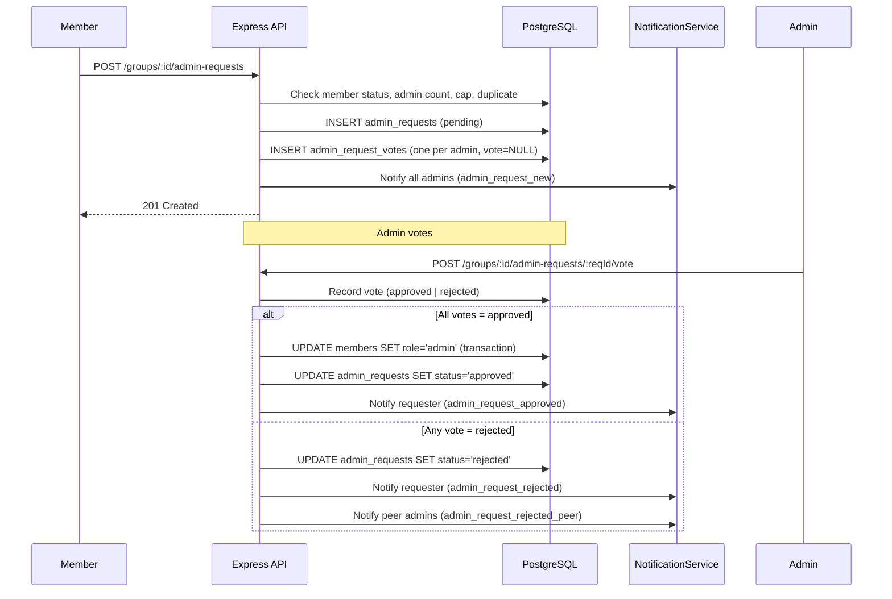

# Design Document: Group Admin Request System

## Overview

The Group Admin Request System adds a governed promotion workflow to NjangiPay groups. An approved member can request elevation to the admin role; all existing admins must unanimously approve before the role is granted. A single rejection immediately denies the request. The system enforces a dynamic admin cap, routes votes to all current admins, and notifies all relevant parties at each stage.

The feature touches three layers:
- **Database** — two new tables (`admin_requests`, `admin_request_votes`) and a migration
- **Backend** — a new `adminRequestController.js` and new routes appended to `backend/src/routes/groups.js`
- **Web** — additions to `web/src/api/groups.js` and `web/src/pages/GroupDetail.jsx`

---

## Architecture



### Admin Cap Formula

```
Admin_Cap = MAX(1, FLOOR(approved_member_count / 10) * 3)
```

| Approved Members | Cap |
|-----------------|-----|
| 1–9             | 1   |
| 10–19           | 3   |
| 20–29           | 6   |
| 30–39           | 9   |

The cap is computed fresh on every request submission — no caching.

---

## Components and Interfaces

### Backend: `adminRequestController.js`

```
submitAdminRequest(req, res, next)
  POST /groups/:groupId/admin-requests
  Auth: authenticate + requireProfileComplete
  - Verify caller is approved member (role='member')
  - Compute admin cap; reject 409 if at cap
  - Reject 409 if pending request already exists
  - INSERT admin_requests row
  - INSERT admin_request_votes rows (one per admin)
  - Notify all admins
  → 201 { success, data: { requestId } }

voteOnAdminRequest(req, res, next)
  POST /groups/:groupId/admin-requests/:requestId/vote
  Auth: authenticate + requireProfileComplete
  Body: { vote: 'approved'|'rejected', rejection_reason?: string }
  - Verify caller is admin in group
  - Verify request is pending (else 409)
  - Verify caller has a NULL vote row (else 409 "Already voted")
  - Record vote
  - If rejected → set request rejected, notify requester + peer admins
  - If all votes approved → promote member, set request approved, notify requester
  → 200 { success, message }

getAdminRequests(req, res, next)
  GET /groups/:groupId/admin-requests
  Auth: authenticate (admin only)
  → 200 { success, data: AdminRequest[] }

getMyAdminRequest(req, res, next)
  GET /groups/:groupId/admin-requests/my
  Auth: authenticate (member)
  → 200 { success, data: AdminRequest | null }
```

### New Routes (appended to `backend/src/routes/groups.js`)

```javascript
router.post('/:id/admin-requests', requireProfileComplete, submitAdminRequest);
router.post('/:id/admin-requests/:requestId/vote', requireProfileComplete, voteOnAdminRequest);
router.get('/:id/admin-requests', getAdminRequests);
router.get('/:id/admin-requests/my', getMyAdminRequest);
```

### Frontend: `web/src/api/groups.js` additions

```javascript
export const submitAdminRequest = (groupId) =>
  api.post(`/groups/${groupId}/admin-requests`);

export const voteOnAdminRequest = (groupId, requestId, data) =>
  api.post(`/groups/${groupId}/admin-requests/${requestId}/vote`, data);

export const getAdminRequests = (groupId) =>
  api.get(`/groups/${groupId}/admin-requests`);

export const getMyAdminRequest = (groupId) =>
  api.get(`/groups/${groupId}/admin-requests/my`);
```

### Frontend: `GroupDetail.jsx` additions

Two new UI sections are added conditionally:

1. **Member section** — shown when `role='member'` and group is active/forming:
   - "Request Admin Role" button (hidden if cap reached or pending request exists)
   - "Admin Request Pending" disabled indicator (shown when pending request exists)

2. **Admin section** — shown when `role='admin'`:
   - List of pending admin requests with requester name and date
   - Approve button per request
   - Reject button per request (opens inline reason input before submitting)

---

## Data Models

### `admin_requests` table

```sql
CREATE TABLE IF NOT EXISTS admin_requests (
  id            UUID PRIMARY KEY DEFAULT uuid_generate_v4(),
  group_id      UUID NOT NULL REFERENCES groups(id) ON DELETE CASCADE,
  requester_id  UUID NOT NULL REFERENCES users(id),
  status        VARCHAR(20) NOT NULL DEFAULT 'pending'
                  CHECK (status IN ('pending', 'approved', 'rejected')),
  created_at    TIMESTAMP DEFAULT NOW(),
  updated_at    TIMESTAMP DEFAULT NOW(),
  UNIQUE (group_id, requester_id)
);

CREATE INDEX IF NOT EXISTS idx_admin_requests_group     ON admin_requests(group_id);
CREATE INDEX IF NOT EXISTS idx_admin_requests_requester ON admin_requests(requester_id);
```

> The UNIQUE constraint on `(group_id, requester_id)` enforces one active request per member per group. A member may submit a new request only after a previous one has been resolved (approved/rejected) — the application layer enforces the "pending only" check.

### `admin_request_votes` table

```sql
CREATE TABLE IF NOT EXISTS admin_request_votes (
  id               UUID PRIMARY KEY DEFAULT uuid_generate_v4(),
  request_id       UUID NOT NULL REFERENCES admin_requests(id) ON DELETE CASCADE,
  admin_id         UUID NOT NULL REFERENCES users(id),
  vote             VARCHAR(20) CHECK (vote IN ('approved', 'rejected')),
  rejection_reason TEXT,
  voted_at         TIMESTAMP,
  UNIQUE (request_id, admin_id)
);

CREATE INDEX IF NOT EXISTS idx_admin_request_votes_request ON admin_request_votes(request_id);
```

### Response shape: `AdminRequest`

```json
{
  "id": "uuid",
  "group_id": "uuid",
  "requester_id": "uuid",
  "requester_name": "string",
  "status": "pending | approved | rejected",
  "created_at": "ISO8601",
  "votes": [
    { "admin_id": "uuid", "admin_name": "string", "vote": "approved | rejected | null" }
  ]
}
```

---

## Correctness Properties

*A property is a characteristic or behavior that should hold true across all valid executions of a system — essentially, a formal statement about what the system should do. Properties serve as the bridge between human-readable specifications and machine-verifiable correctness guarantees.*

### Property 1: Admin cap formula correctness

*For any* non-negative integer `n` representing approved member count, the computed Admin_Cap SHALL equal `Math.max(1, Math.floor(n / 10) * 3)`.

**Validates: Requirements 1.1**

---

### Property 2: Cap enforcement blocks submission

*For any* group where the current admin count equals or exceeds the Admin_Cap, a submission attempt by an approved member SHALL be rejected with HTTP 409.

**Validates: Requirements 1.2**

---

### Property 3: Role and status guard on submission

*For any* user whose membership record does not have both `status='approved'` and `role='member'`, a submission attempt SHALL be rejected with HTTP 403.

**Validates: Requirements 2.1**

---

### Property 4: Vote rows equal admin count at creation

*For any* group with N admins, when a new Admin_Request is created, exactly N `admin_request_votes` rows SHALL be inserted with `vote = NULL`.

**Validates: Requirements 2.4, 3.1, 4.1**

---

### Property 5: Duplicate request guard

*For any* member who already has a pending Admin_Request in a group, a second submission SHALL be rejected with HTTP 409 and message "A pending request already exists".

**Validates: Requirements 2.3**

---

### Property 6: Unanimous approval promotes member atomically

*For any* Admin_Request where all N vote rows are set to `approved`, the requesting member's `role` SHALL be updated to `admin` AND the request `status` SHALL be set to `approved` within the same database transaction.

**Validates: Requirements 4.2, 6.1**

---

### Property 7: Single rejection immediately closes request

*For any* pending Admin_Request, when any admin submits a rejection vote, the request `status` SHALL immediately become `rejected` regardless of how many other votes are still NULL.

**Validates: Requirements 5.1**

---

### Property 8: Voting on non-pending request is blocked

*For any* Admin_Request with `status != 'pending'`, any attempt to submit a vote SHALL return HTTP 409 with message "Request is no longer pending".

**Validates: Requirements 5.4**

---

### Property 9: Notification fan-out matches admin count

*For any* group with N admins, when a new Admin_Request is created, exactly N notification rows of type `admin_request_new` SHALL be persisted to the `notifications` table.

**Validates: Requirements 2.5, 7.1**

---

### Property 10: Rejection notifications are complete and accurate

*For any* rejection event with an optional reason string, the requester SHALL receive exactly one notification of type `admin_request_rejected` containing the reason (if provided), and all other admins (N-1) SHALL each receive one notification of type `admin_request_rejected_peer`.

**Validates: Requirements 5.2, 5.3, 7.3, 7.4**

---

### Property 11: UI button state reflects request state

*For any* combination of (member role, admin cap reached, pending request exists), the GroupDetail page SHALL render exactly the correct UI element: the "Request Admin Role" button, the "Admin Request Pending" indicator, or neither.

**Validates: Requirements 9.1, 9.2, 9.3**

---

## Error Handling

| Scenario | HTTP Status | Message |
|---|---|---|
| Caller not an approved member | 403 | "You must be an approved member to request admin role" |
| Admin cap reached | 409 | "Admin cap reached for this group size" |
| Pending request already exists | 409 | "A pending request already exists" |
| Request not found | 404 | "Admin request not found" |
| Caller not an admin in group | 403 | "Only group admins can vote" |
| Admin already voted | 409 | "You have already voted on this request" |
| Request no longer pending | 409 | "Request is no longer pending" |
| Non-member accessing admin requests | 403 | "Access denied" |
| Invalid vote value | 400 | "Vote must be 'approved' or 'rejected'" |

All errors follow the existing `{ success: false, message: string }` envelope used throughout the codebase.

Database errors and unexpected failures are passed to `next(error)` for the global error handler.

---

## Testing Strategy

### Unit / Integration Tests (Jest)

Focus on specific examples, edge cases, and controller logic:

- Happy path: submit request, vote approve (single admin), verify promotion
- Happy path: submit request, all admins approve (multi-admin), verify promotion
- Rejection path: one admin rejects, verify immediate closure
- Duplicate request returns 409
- Non-member submission returns 403
- Vote on resolved request returns 409
- Admin cap boundary: exactly at cap returns 409, one below cap succeeds
- Notification rows created for each scenario

### Property-Based Tests (fast-check)

Use [fast-check](https://github.com/dubzzz/fast-check) for the Node.js backend. Each property test runs a minimum of 100 iterations.

Tag format: `// Feature: group-admin-requests, Property N: <property text>`

| Property | Generator | Assertion |
|---|---|---|
| P1: Cap formula | `fc.integer({ min: 0, max: 500 })` | `computeCap(n) === Math.max(1, Math.floor(n/10)*3)` |
| P2: Cap enforcement | Generate group state where `adminCount >= cap` | Response is 409 |
| P3: Role/status guard | Generate all (status, role) combinations | Only approved+member gets 201 |
| P4: Vote row count | `fc.integer({ min: 1, max: 10 })` for admin count | `voteRows.length === adminCount` |
| P5: Duplicate guard | Valid member, submit twice | Second returns 409 |
| P6: Unanimous approval | N admins, simulate N approvals | `member.role='admin'` AND `request.status='approved'` |
| P7: Single rejection closes | N admins, one rejects | `request.status='rejected'` immediately |
| P8: Vote on resolved | Generate resolved request | Returns 409 |
| P9: Notification fan-out | `fc.integer({ min: 1, max: 10 })` for admin count | Exactly N notification rows |
| P10: Rejection notifications | Optional rejection reason string | Correct rows for requester and N-1 peers |
| P11: UI button state | Generate `{ isAdmin, capReached, hasPending }` booleans | Correct element rendered |

### Migration Smoke Test

A single test verifies that after running the migration:
- `admin_requests` table exists with all required columns and constraints
- `admin_request_votes` table exists with all required columns and constraints
- All indexes are present
- UNIQUE constraints are enforced

**Validates: Requirements 11.1–11.5**
