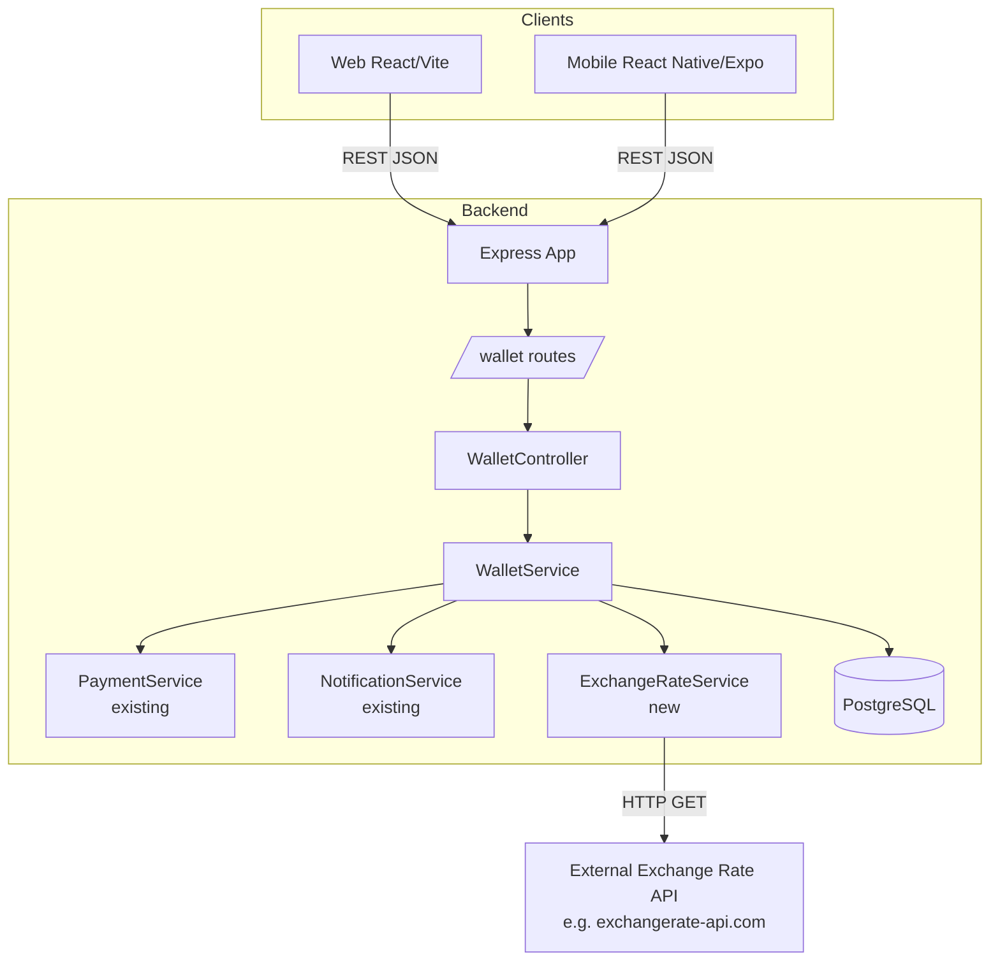

# Design Document: Trust Coin Wallet

## Overview

Trust Coin (TC) is Via's in-app currency that replaces the legacy `trust_score` integer field. Each TC is worth exactly 10,000 XAF. Users fund a TC wallet with real money, use it for group contributions, receive payouts into it, and send peer-to-peer transfers — all without leaving the app.

The feature introduces a `WalletService` on the backend, a new `/wallet` route group, a migration that swaps `trust_score` for `tc_balance`, and new screens on both the web (React/Vite) and mobile (React Native/Expo) frontends.

### Key Design Decisions

- **Fixed XAF rate, live cross-currency rates.** 1 TC = 10,000 XAF is a hard constant. Rates for USD, EUR, GBP, NGN, GHS, KES are fetched from an external Exchange Rate API and cached for 60 minutes in-process (a simple `Map` with a timestamp). This avoids a Redis dependency while meeting the staleness requirement.
- **Row-level locking for all debits.** Every operation that reduces a balance uses `SELECT ... FOR UPDATE` inside a `BEGIN/COMMIT` block, preventing concurrent overdrafts without application-level locks.
- **Wallet code generated lazily.** The `wallet_code` column is `NULL` until the user first opens the wallet screen, at which point the backend generates a unique `VIA-XXXXX` code and persists it. This avoids generating codes for users who never use the wallet.
- **Withdrawal reversal via compensating transaction.** If the external disbursement fails after the TC has been deducted, the service inserts a compensating credit transaction and restores the balance within the same DB transaction scope.
- **Fee calculation uses ceiling rounding.** The 0.5% external transfer fee is rounded up to the nearest 0.01 TC using `Math.ceil(amount * 0.005 * 100) / 100`.
- **`trust_score` column renamed, not dropped immediately.** The migration renames `trust_score` to `tc_balance` and changes the type to `DECIMAL(18,8)`. All existing integer values are preserved as-is (they become TC balances). A follow-up migration can zero them out if needed. All API responses replace `trust_score` with `tc_balance`.

---

## Architecture



The `WalletService` is the single source of truth for all TC balance mutations. No other service or controller touches `tc_balance` directly — they call `WalletService` methods instead. The existing `contributionController` will be updated to delegate wallet-funded contributions to `WalletService`.

---

## Components and Interfaces

### Backend

#### `WalletService` (`backend/src/services/walletService.js`)

```js
// Initialise wallet for a new user (called from authController on registration)
initWallet(userId, client?)

// Get wallet info: balance, wallet_code, preferred_currency
getWallet(userId)

// Generate or return existing wallet_code
activateWalletCode(userId)

// Top-up: credit TC from fiat payment
topUp({ userId, xafAmount, paymentMethod, phone })

// Withdrawal: debit TC, disburse fiat
withdraw({ userId, tcAmount, destination })
// destination: { method, phone?, accountDetails?, cardDetails? }

// Contribution via wallet (called by contributionController)
payContribution({ userId, groupId, cycleNumber, tcAmount })

// Credit payout into wallet (called by payoutQueueService)
creditPayout({ userId, groupId, payoutId, xafAmount })

// Peer-to-peer transfer
transfer({ senderId, recipientIdentifier, tcAmount })

// Transfer preview (fee calculation + fiat equivalents)
getTransferPreview({ senderId, recipientIdentifier, tcAmount })

// Transaction history (paginated)
getTransactions({ userId, type?, limit, offset })

// Check withdrawal/transfer limits (called internally before any debit)
checkLimits({ userId, tcAmount, isVerified })
// Returns { allowed: bool, reason?, limitType?, currentTotal?, limit?, resetsAt? }
```

#### `ExchangeRateService` (`backend/src/services/exchangeRateService.js`)

```js
// Returns { XAF: 1, USD: x, EUR: x, GBP: x, NGN: x, GHS: x, KES: x }
// XAF is always computed from the fixed 10,000 rate; others from live API
getRates()

// Convert tcAmount to all supported currencies
convertTC(tcAmount)
// Returns { XAF, USD, EUR, GBP, NGN, GHS, KES, stale: bool }
```

Internal cache: `{ rates: Map, fetchedAt: Date }`. If `Date.now() - fetchedAt < 60 * 60 * 1000`, return cached. On API failure, return last cached with `stale: true`.

#### Withdrawal and Transfer Limits

The `WalletService` enforces per-user limits on withdrawals and outgoing transfers to prevent abuse and comply with financial regulations. **All debit operations require identity verification** (`profile_complete = true`).

| Limit Type | Value |
|-----------|-------|
| **Single Transaction Max** | 200 TC (2,000,000 XAF) |
| **Daily Limit** | 500 TC (5,000,000 XAF) |
| **Monthly Limit** | 2,000 TC (20,000,000 XAF) |

**Unverified users** (`profile_complete = false`) can:
- ✅ Top up their wallet
- ✅ Receive incoming transfers
- ✅ Receive payouts
- ❌ Withdraw
- ❌ Send transfers
- ❌ Pay contributions

**Rolling total calculation:**
- Daily: Sum of all `withdrawal` and `transfer_out` transactions with `created_at` in the current calendar day (UTC)
- Monthly: Sum of all `withdrawal` and `transfer_out` transactions with `created_at` in the current calendar month (UTC)

**Limit check order:**
1. Verify `profile_complete = true` (reject if false)
2. Single transaction max (immediate rejection if exceeded)
3. Daily limit (check rolling total for today)
4. Monthly limit (check rolling total for this month)

**Error response includes:**
- `limitType`: "single" | "daily" | "monthly" | "profile_incomplete"
- `currentTotal`: TC amount already withdrawn/transferred in the period
- `limit`: The applicable limit value
- `resetsAt`: ISO timestamp when the limit resets

#### `WalletController` (`backend/src/controllers/walletController.js`)

Thin HTTP adapter — validates input with `express-validator`, calls `WalletService`, returns JSON. No business logic lives here.

#### Route: `/wallet` (`backend/src/routes/wallet.js`)

All routes require `authenticate` + `requireProfileComplete`.

| Method | Path | Handler |
|--------|------|---------|
| GET | `/wallet` | `getWallet` |
| POST | `/wallet/topup` | `topUp` |
| POST | `/wallet/withdraw` | `withdraw` |
| POST | `/wallet/transfer` | `transfer` |
| GET | `/wallet/transfer/preview` | `getTransferPreview` |
| GET | `/wallet/transactions` | `getTransactions` |

#### Changes to existing files

- `authController.js` — call `walletService.initWallet(userId)` after user insert.
- `contributionController.js` — add `tc_wallet` to the allowed `payment_method` enum; when selected, delegate to `walletService.payContribution(...)` instead of `processPayment(...)`.
- `payoutQueueService.js` — after marking a payout `completed`, call `walletService.creditPayout(...)`.
- `userController.js` — remove `trust_score` from all `SELECT` and `RETURNING` clauses; add `tc_balance`, `wallet_code`, `preferred_currency`.
- `auth.js` middleware — update the `authenticate` query to select `tc_balance` instead of `trust_score`.

### Frontend — Web (React/Vite)

New files under `web/src/`:

| File | Purpose |
|------|---------|
| `api/wallet.js` | API client functions for all wallet endpoints |
| `pages/Wallet.jsx` | Main wallet screen (balance, wallet code, quick actions) |
| `pages/Wallet.module.css` | Styles |
| `pages/TopUp.jsx` | Top-up flow (amount + method selection) |
| `pages/Withdraw.jsx` | Withdrawal flow |
| `pages/Transfer.jsx` | Transfer flow (recipient + amount + confirmation) |
| `pages/TransactionHistory.jsx` | Paginated transaction list with type filter |
| `components/TCBalance.jsx` | Reusable balance display with multi-currency toggle |
| `components/WalletCode.jsx` | Wallet code display with copy button |
| `components/TransferConfirm.jsx` | Confirmation modal showing fee breakdown |

The `Dashboard.jsx` will be updated to show a TC balance summary card linking to `/wallet`.

### Frontend — Mobile (React Native/Expo)

New files under `mobile/src/`:

| File | Purpose |
|------|---------|
| `api/wallet.js` | API client functions |
| `screens/WalletScreen.js` | Main wallet screen |
| `screens/TopUpScreen.js` | Top-up flow |
| `screens/WithdrawScreen.js` | Withdrawal flow |
| `screens/TransferScreen.js` | Transfer flow |
| `screens/TransactionHistoryScreen.js` | Transaction list |
| `components/TCBalance.js` | Balance display component |
| `components/WalletCode.js` | Wallet code with copy |
| `components/TransferConfirm.js` | Confirmation sheet |

`AppNavigator.js` gains a `Wallet` stack navigator. `DashboardScreen.js` gains a TC balance card.

---

## Data Models

### Migration: `add_trust_coin_wallet.sql`

```sql
-- 1. Rename trust_score → tc_balance, change type
ALTER TABLE users
  RENAME COLUMN trust_score TO tc_balance;

ALTER TABLE users
  ALTER COLUMN tc_balance TYPE DECIMAL(18,8) USING tc_balance::DECIMAL(18,8),
  ALTER COLUMN tc_balance SET DEFAULT 0.00000000;

-- 2. Wallet code and preferred currency
ALTER TABLE users
  ADD COLUMN IF NOT EXISTS wallet_code VARCHAR(10) UNIQUE,
  ADD COLUMN IF NOT EXISTS preferred_currency VARCHAR(3) DEFAULT 'XAF'
    CHECK (preferred_currency IN ('XAF','USD','EUR','GBP','NGN','GHS','KES'));

-- 3. Wallet transactions table
CREATE TABLE IF NOT EXISTS wallet_transactions (
  id            UUID PRIMARY KEY DEFAULT uuid_generate_v4(),
  user_id       UUID NOT NULL REFERENCES users(id),
  type          VARCHAR(20) NOT NULL
                  CHECK (type IN ('top_up','withdrawal','contribution','payout','transfer_in','transfer_out')),
  tc_amount     DECIMAL(18,8) NOT NULL,
  xaf_amount    DECIMAL(18,2),          -- fiat equivalent at time of transaction
  fee_tc        DECIMAL(18,8) DEFAULT 0,
  payment_method VARCHAR(30),           -- mtn_momo, orange_money, bank_transfer, card, tc_wallet
  external_tx_id VARCHAR(100),
  counterparty_user_id UUID REFERENCES users(id),
  counterparty_name    VARCHAR(100),
  group_id      UUID REFERENCES groups(id),
  payout_id     UUID REFERENCES payouts(id),
  cycle_number  INTEGER,
  status        VARCHAR(20) DEFAULT 'completed'
                  CHECK (status IN ('pending','completed','failed','reversed')),
  created_at    TIMESTAMP DEFAULT NOW()
);

CREATE INDEX IF NOT EXISTS idx_wallet_tx_user    ON wallet_transactions(user_id);
CREATE INDEX IF NOT EXISTS idx_wallet_tx_type    ON wallet_transactions(user_id, type);
CREATE INDEX IF NOT EXISTS idx_wallet_tx_created ON wallet_transactions(user_id, created_at DESC);
```

### `users` table (after migration)

| Column | Type | Notes |
|--------|------|-------|
| `tc_balance` | `DECIMAL(18,8)` | Replaces `trust_score`; default `0` |
| `wallet_code` | `VARCHAR(10)` | Unique, nullable until first activation |
| `preferred_currency` | `VARCHAR(3)` | Default `'XAF'` |

### `wallet_transactions` table

| Column | Type | Notes |
|--------|------|-------|
| `id` | UUID | PK |
| `user_id` | UUID | FK → users |
| `type` | VARCHAR(20) | Enum: top_up, withdrawal, contribution, payout, transfer_in, transfer_out |
| `tc_amount` | DECIMAL(18,8) | Always positive; direction implied by type |
| `xaf_amount` | DECIMAL(18,2) | Fiat equivalent at transaction time |
| `fee_tc` | DECIMAL(18,8) | Fee charged (0 for most types) |
| `payment_method` | VARCHAR(30) | External method or `tc_wallet` |
| `external_tx_id` | VARCHAR(100) | From PaymentService |
| `counterparty_user_id` | UUID | For transfers |
| `counterparty_name` | VARCHAR(100) | Denormalised for history display |
| `group_id` | UUID | For contributions/payouts |
| `payout_id` | UUID | For payout credits |
| `cycle_number` | INTEGER | For contributions |
| `status` | VARCHAR(20) | pending → completed / failed / reversed |
| `created_at` | TIMESTAMP | Indexed DESC |

### Wallet Code Generation

```
VIA-[A-Z0-9]{5}
```

Generated with `crypto.randomBytes` + base-36 encoding, uppercased, truncated to 5 chars, retried on collision (collision probability is negligible at scale but the retry loop is required by Requirement 1.4).

---

## Correctness Properties

*A property is a characteristic or behavior that should hold true across all valid executions of a system — essentially, a formal statement about what the system should do. Properties serve as the bridge between human-readable specifications and machine-verifiable correctness guarantees.*

### Property 1: Balance non-negativity invariant

*For any* sequence of wallet operations (top-up, withdrawal, contribution, transfer) applied to any user, the resulting `tc_balance` SHALL never be negative.

**Validates: Requirements 3.4, 4.2, 6.4, 10.4**

---

### Property 2: Top-up credit round-trip

*For any* valid XAF amount ≥ 100, after a successful top-up the user's `tc_balance` SHALL increase by exactly `xafAmount / 10000` TC, and a `top_up` transaction record SHALL exist with that exact `tc_amount`.

**Validates: Requirements 2.2, 2.4**

---

### Property 3: Withdrawal debit round-trip

*For any* TC amount ≥ 0.01 where the user's balance is sufficient, after a successful withdrawal the user's `tc_balance` SHALL decrease by exactly the requested TC amount, and a `withdrawal` transaction record SHALL exist with that exact `tc_amount`.

**Validates: Requirements 3.4, 3.6**

---

### Property 4: Withdrawal reversal restores balance

*For any* withdrawal where the external disbursement fails, the user's `tc_balance` SHALL be identical to its value before the withdrawal was initiated.

**Validates: Requirements 3.5, 10.2**

---

### Property 5: Transfer atomicity and conservation

*For any* valid peer-to-peer transfer of amount A with fee F, the sender's balance SHALL decrease by exactly `A + F` and the recipient's balance SHALL increase by exactly `A`. The total TC in the system (sum of all balances) SHALL decrease by exactly `F` (the fee is consumed).

**Validates: Requirements 6.7, 6.8, 6.9, 10.1**

---

### Property 6: Fee calculation correctness

*For any* transfer amount A between users who share no common active group, the fee SHALL equal `ceil(A × 0.005 × 100) / 100` TC. *For any* transfer between users who share at least one common active group, the fee SHALL equal 0.00 TC. *For any* wallet-funded contribution or payout credit, the fee SHALL equal 0.00 TC.

**Validates: Requirements 4.5, 5.3, 6.5, 6.6**

---

### Property 7: Wallet code uniqueness

*For any* set of users who have activated their wallet codes, no two users SHALL share the same `wallet_code`.

**Validates: Requirements 1.3, 1.4**

---

### Property 8: Transaction history completeness

*For any* balance-modifying operation that completes successfully, a corresponding `wallet_transactions` record SHALL exist for the affected user(s) with the correct `type`, `tc_amount`, and `status = 'completed'`.

**Validates: Requirements 2.4, 3.6, 4.4, 5.2, 6.8, 6.9**

---

### Property 9: Currency conversion consistency

*For any* TC amount, the XAF equivalent SHALL always equal `tc_amount × 10000`, regardless of the state of the Exchange Rate Service.

**Validates: Requirements 8.5**

---

### Property 11: Exchange rate cache TTL

*For any* call to `ExchangeRateService.getRates()` made within 60 minutes of the previous successful fetch, the service SHALL return the cached rates without making a new external API call. *For any* call made more than 60 minutes after the last successful fetch, the service SHALL attempt a fresh fetch.

**Validates: Requirements 8.3**

---

### Property 10: Insufficient balance rejection

*For any* debit operation (withdrawal, contribution, transfer) where the requested TC amount exceeds the user's current balance, the operation SHALL be rejected, the balance SHALL remain unchanged, and no transaction record SHALL be inserted.

**Validates: Requirements 3.2, 3.3, 4.1, 4.2, 6.3, 6.4**

---

### Property 11: Exchange rate cache TTL

*For any* call to `ExchangeRateService.getRates()` made within 60 minutes of the previous successful fetch, the service SHALL return the cached rates without making a new external API call. *For any* call made more than 60 minutes after the last successful fetch, the service SHALL attempt a fresh fetch.

**Validates: Requirements 8.3**

---

### Property 12: Exchange rate resilience

*For any* state of the Exchange Rate Service (available or unavailable), wallet operations (transfers, withdrawals, top-ups) SHALL complete without being blocked by rate service failures. When the rate service is unavailable, fiat equivalents SHALL be returned using the last successfully cached rates with `stale: true`, rather than returning an error.

**Validates: Requirements 7.4, 8.4**

---

## Error Handling

| Scenario | HTTP Status | Error Code | Behaviour |
|----------|-------------|------------|-----------|
| Insufficient TC balance | 400 | `INSUFFICIENT_BALANCE` | Reject; balance unchanged |
| Top-up amount < 100 XAF | 400 | `AMOUNT_TOO_SMALL` | Reject before payment |
| Withdrawal amount < 0.01 TC | 400 | `AMOUNT_TOO_SMALL` | Reject |
| Single transaction limit exceeded | 400 | `LIMIT_EXCEEDED` | Reject; include limit, current total, reset time |
| Daily limit exceeded | 400 | `LIMIT_EXCEEDED` | Reject; include limit, current total, resets at midnight UTC |
| Monthly limit exceeded | 400 | `LIMIT_EXCEEDED` | Reject; include limit, current total, resets first of next month |
| Recipient not found | 404 | `RECIPIENT_NOT_FOUND` | Reject transfer |
| External payment failure | 400 | `PAYMENT_FAILED` | Balance unchanged; descriptive message from PaymentService |
| External disbursement failure | 500 | `DISBURSEMENT_FAILED` | TC deduction reversed; balance restored |
| Exchange Rate API unavailable | — | — | Return last cached rates with `stale: true`; never block the operation |
| Wallet code collision | — | — | Retry generation (max 5 attempts); log if all fail |
| Concurrent debit race | — | — | `SELECT FOR UPDATE` serialises access; second request sees updated balance |
| Unauthenticated request | 401 | — | Standard auth middleware response |
| Profile incomplete | 403 | `PROFILE_INCOMPLETE` | Standard middleware response |

All errors follow the existing `{ success: false, message: string, code?: string }` envelope.

---

## Testing Strategy

### Unit Tests (Jest)

Focus on pure logic and service-layer behaviour with mocked DB and external services.

- `walletService.test.js`
  - Top-up credits correct TC amount for various XAF inputs
  - Top-up rejects amounts < 100 XAF
  - Withdrawal rejects when balance insufficient
  - Withdrawal reversal restores balance on disbursement failure
  - Transfer fee is 0 for group-shared users, 0.5% (ceiling) for external
  - Transfer rejects when sender balance < amount + fee
  - `getTransferPreview` returns correct breakdown
  - Transaction records are inserted with correct fields

- `exchangeRateService.test.js`
  - Returns cached rates within 60-minute TTL
  - Fetches fresh rates after TTL expires
  - Returns stale rates with `stale: true` on API failure
  - XAF conversion always uses fixed 10,000 rate

- `walletCode.test.js`
  - Generated codes match `VIA-[A-Z0-9]{5}` format
  - Retry loop handles collision

### Property-Based Tests (fast-check)

Using [fast-check](https://github.com/dubzzz/fast-check) (already compatible with Jest). Each property test runs a minimum of 100 iterations.

**Feature: trust-coin-wallet**

- **Property 1: Balance non-negativity invariant**
  Generate arbitrary sequences of valid and invalid operations; assert `tc_balance >= 0` after each step.
  `// Feature: trust-coin-wallet, Property 1: balance never goes negative`

- **Property 2: Top-up credit round-trip**
  Generate arbitrary XAF amounts ≥ 100; assert balance delta = `xafAmount / 10000`.
  `// Feature: trust-coin-wallet, Property 2: top-up credit round-trip`

- **Property 3: Withdrawal debit round-trip**
  Generate arbitrary TC amounts ≤ current balance; assert balance delta = `-tcAmount`.
  `// Feature: trust-coin-wallet, Property 3: withdrawal debit round-trip`

- **Property 4: Withdrawal reversal restores balance**
  Simulate disbursement failure; assert balance equals pre-withdrawal value.
  `// Feature: trust-coin-wallet, Property 4: withdrawal reversal restores balance`

- **Property 5: Transfer atomicity and conservation**
  Generate arbitrary sender balance and transfer amount ≤ balance; assert sender delta = `-(amount + fee)`, recipient delta = `+amount`.
  `// Feature: trust-coin-wallet, Property 5: transfer atomicity and conservation`

- **Property 6: Fee calculation correctness**
  Generate arbitrary transfer amounts; assert fee = 0 for group-shared pairs, `ceil(amount × 0.005 × 100) / 100` for external pairs.
  `// Feature: trust-coin-wallet, Property 6: fee calculation correctness`

- **Property 7: Wallet code uniqueness**
  Generate N users; assert all generated wallet codes are distinct and match `VIA-[A-Z0-9]{5}`.
  `// Feature: trust-coin-wallet, Property 7: wallet code uniqueness`

- **Property 8: Transaction history completeness**
  After any successful operation, assert a matching transaction record exists.
  `// Feature: trust-coin-wallet, Property 8: transaction history completeness`

- **Property 9: Currency conversion consistency**
  Generate arbitrary TC amounts; assert XAF equivalent = `tcAmount × 10000` regardless of mock exchange rate state.
  `// Feature: trust-coin-wallet, Property 9: currency conversion consistency`

- **Property 10: Insufficient balance rejection**
  Generate TC amounts > current balance; assert operation rejected, balance unchanged, no transaction inserted.
  `// Feature: trust-coin-wallet, Property 10: insufficient balance rejection`

- **Property 11: Exchange rate cache TTL**
  Mock time progression; assert no external API call within 60 min, fresh call after 60 min.
  `// Feature: trust-coin-wallet, Property 11: exchange rate cache TTL`

- **Property 12: Exchange rate resilience**
  Mock rate service failure; assert wallet operations complete and return stale rates with stale=true.
  `// Feature: trust-coin-wallet, Property 12: exchange rate resilience`

### Integration Tests

- Full top-up flow: POST `/wallet/topup` → verify DB balance and transaction record
- Full withdrawal flow: POST `/wallet/withdraw` → verify DB balance and transaction record
- Transfer between two test users: verify both balances and both transaction records
- Contribution via wallet: POST `/groups/:id/contribute` with `tc_wallet` → verify balance and contribution status
- Transaction history pagination: verify cursor-based pagination returns correct pages

### Frontend Tests

- `TCBalance` component renders correct TC and fiat values
- `TransferConfirm` modal displays correct fee breakdown
- `WalletCode` copy button writes to clipboard
- Wallet screen shows staleness indicator when rates are stale
